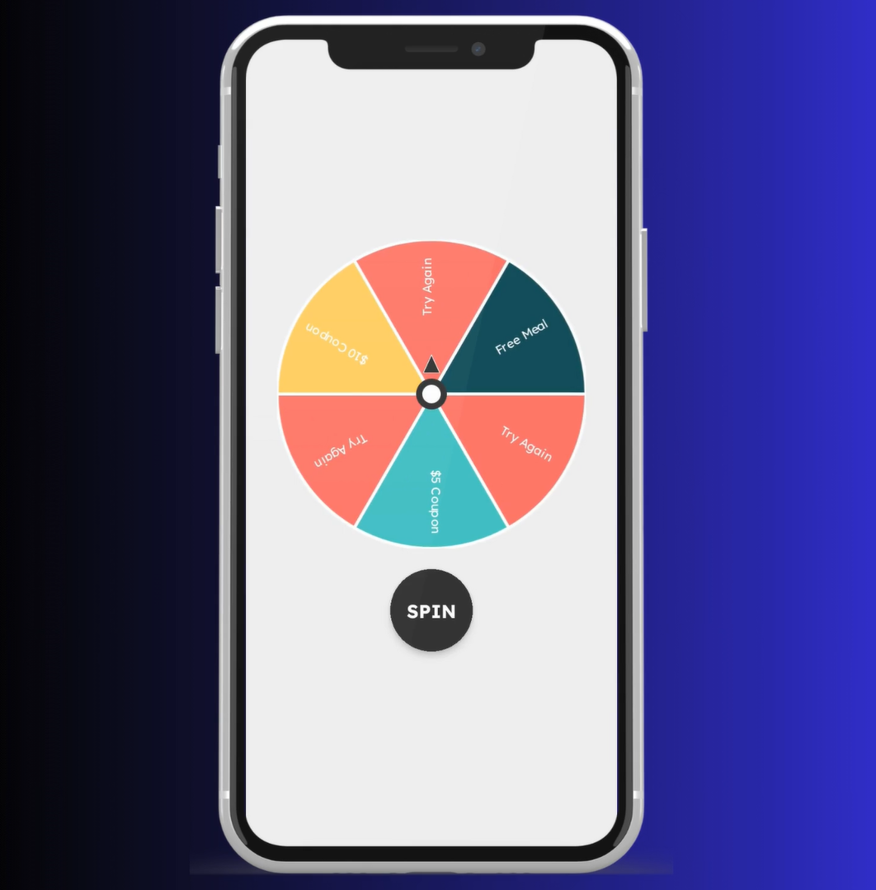
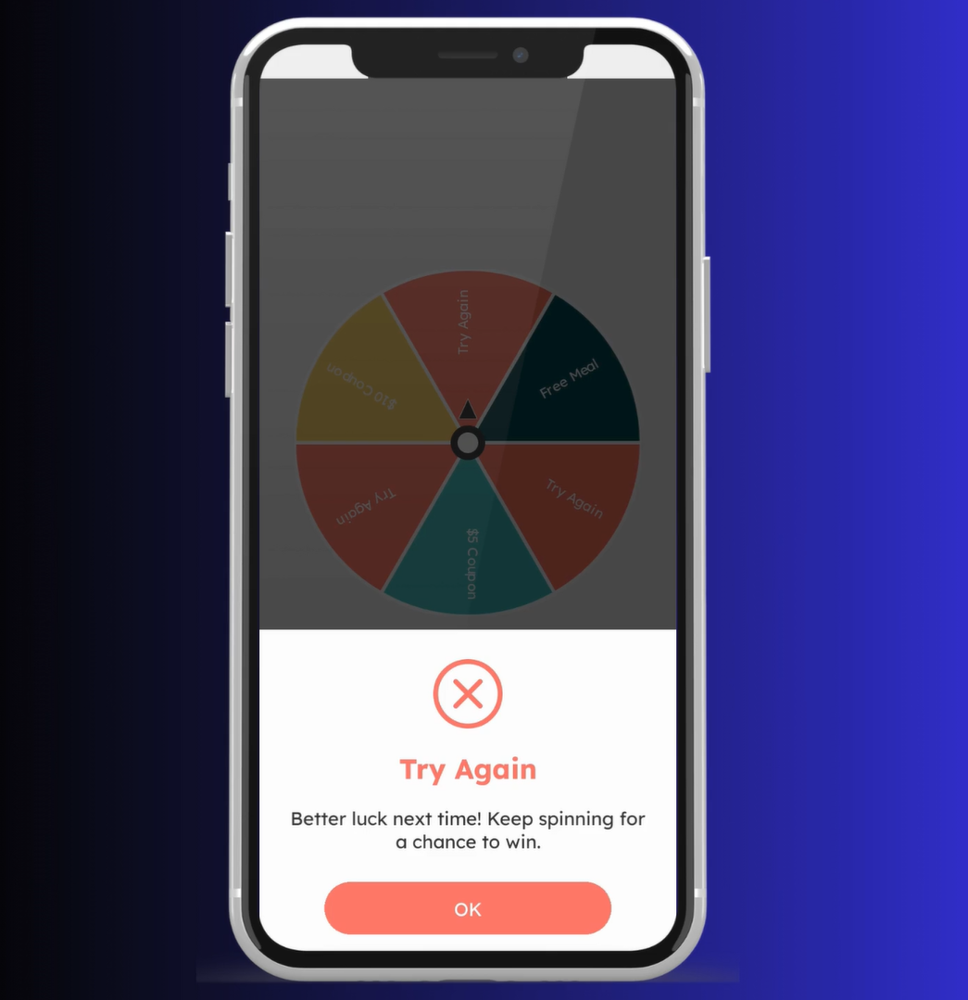

# 🚀 React Native Components

A collection of reusable React Native components to enhance your app development workflow. This repository contains custom-built UI components that are easy to integrate and use.  
## ✨ Features  
- Gesture-based **Top Tab Navigation**  
- Gesture-based **Bottom Tab Navigation**  
- **Spin and Win Wheel** using animations 
## 📖 Components List  
Click on any component name to jump to its details:  

1. [Top Tab Navigation](#-top-tab-navigation)  
2. [Bottom Tab Navigation](#-bottom-tab-navigation)  
3. [Spin and Win Wheel](#-spin-and-win-wheel)  

## 🔧 Installation  

1. Clone this repository:

```bash
 git clone https://github.com/yourusername/react-native-components.git
 cd react-native-components
```
2. Install dependencies:
```bash
 npm install
```
3. Run the project:
```bash
 npm start
```

    
## Top Tab Navigation
A tab navigation system allowing users to swipe left and right to switch screens. Built using `react-native-tab-view`.


## Bottom Tab Navigation
A bottom tab navigation system that supports gesture-based navigation between screens. Also built using `react-native-tab-view`


  
  
</div>

## 📌 Usage

You can integrate these components into your own React Native project by copying the relevant code files or importing them directly if you plan to use this as a shared component library.

If using navigation components, ensure you have `react-native-tab-view` installed:
```bash
 npm install react-native-tab-view
```

For the spin wheel, install `react-native-svg`:
```bash
 npm install react-native-svg
```
## 🤝 Contributing

Contributions are welcome! If you’d like to improve or add new components, follow these steps:

1. Fork the repository.
2. Create a new branch
```bash
 git checkout -b feature-new-component
```
3. Make your changes and commit:
```bash
 git commit -m "Added a new component"
```
4. Push to the branch:
```bash
 git push origin feature-new-component
```
5. Open a Pull Request on GitHub.
## 📄 License
This project is licensed under the MIT License. Feel free to use, modify, and distribute as needed.
